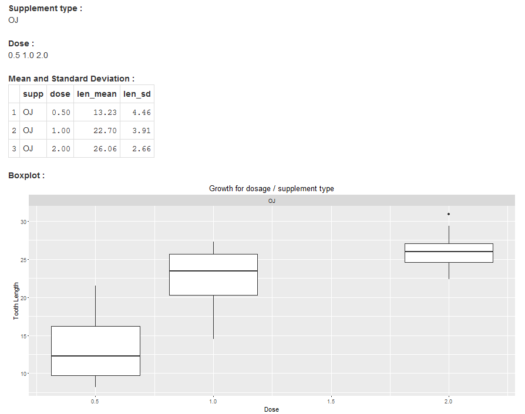

Tooth Growth Analysis Application
========================================================
author: N. Murugavel
date: 12-01-2016

About the application
========================================================

This application is developed as the Developing Data Products course project. 

This uses the **ToothGrowth** dataset. 

This allows the user to select supplement types and doses. 

It then calculates the mean and standard deviations for the selected groups and displays them. It also displays a boxplot for the selected groups.

Link to application : [http://nmurugavel.shinyapps.io/toothgrowthapp](http://nmurugavel.shinyapps.io/toothgrowthapp)

Github repository: [https://github.com/nmurugavel/DDPCourseProject.git](https://github.com/nmurugavel/DDPCourseProject.git)

Inputs
========================================================
left: 30%


***

- **Supplement type** - select one type or ALL. Values in dataset are :

```
[1] VC OJ
Levels: OJ VC
```


- **Dose** - select doses to analyse (if none are selected then all doses are included in the analysis). Values in dataset are :

```
[1] 0.5 1.0 2.0
```

- Click on **Analyse** button to process.


Outputs
========================================================

- **Supplement type** - selected supplement types
- **Dose** - selected doses
- **Mean and Standard Deviation** - table with mean (len_mean) and standard deviation (len_sd) of tooth length
- **Boxplot** - boxplot of tooth length


Outputs
========================================================


